## **Active Machine Write-up**

### **1. Machine Information**

* **Name:** `Active`
* **IP Address:** `10.129.31.152`
* **Difficulty:** `Easy`
* **OS:** `Windows`

---

### **2. Enumeration**

#### **Nmap Scan**

# Initial TCP scan

nmap -sS -sV -sC -Pn -T4 10.129.31.152

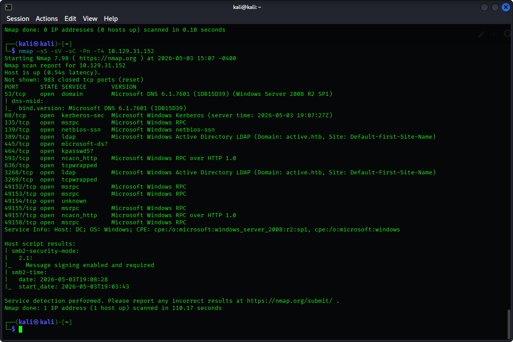

* **Interesting Ports:**
    * `139/tcp` SMB
    * `445/tcp` SMB
    * `389/tcp` LDAP port
    * `636/tcp` LDAPS port

#### **Service Discovery**

By attempting to connect using `smbclient` we have found that anonymous login without a password was allowed. Using `smbmap` to identify all shares’ permissions. We noticed that the `Replication` share has a `READ ONLY` access. 

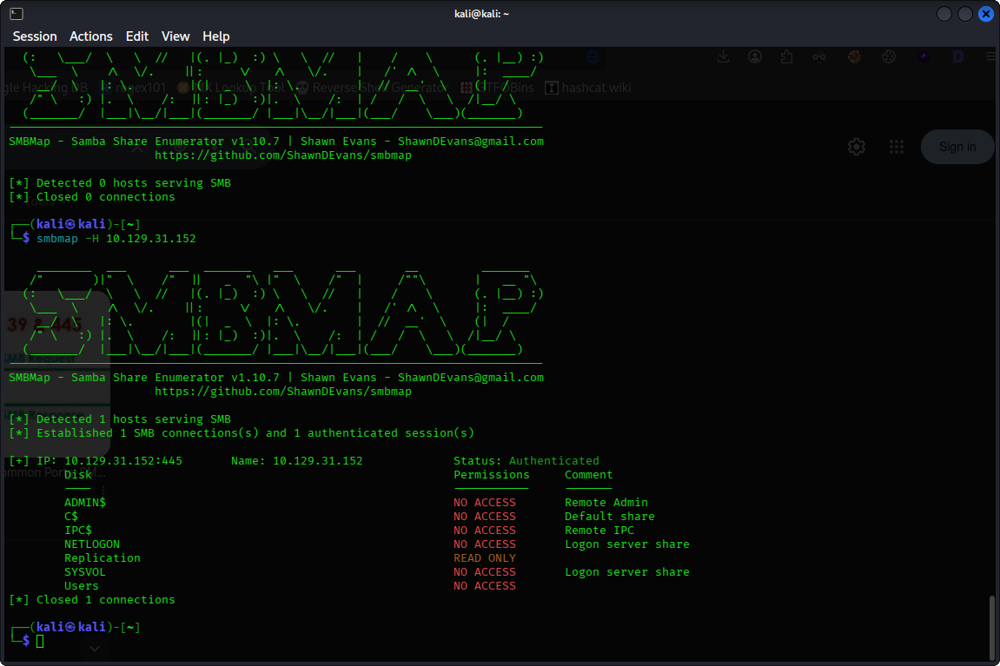

By accessing `Replication` and downloading all files inside using `mget*` we find a `Groups.xml `file which might contain usernames and passwords

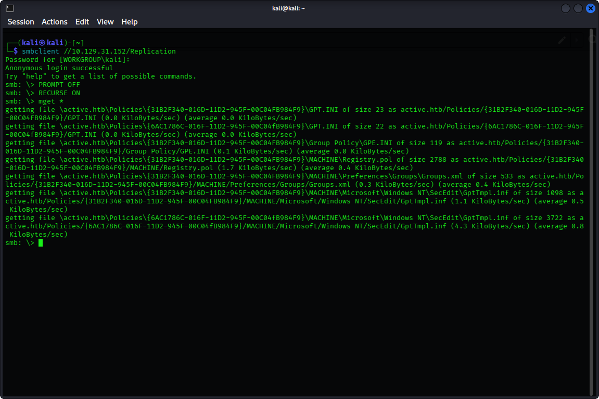

Looking inside `Groups.xml` we have successfully found a username: `SVC_TGS` and a 

password Base64 encoded: `edBSHOwhZLTjt/QS9FeIcJ83mjWA98gw9guKOhJOdcqh`

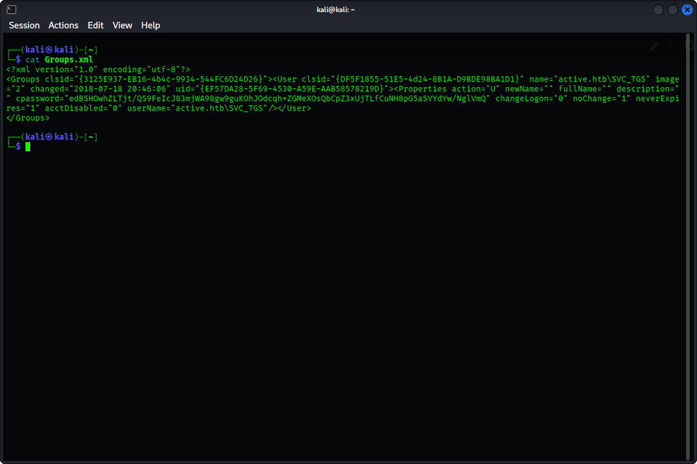

---

### **3. Exploitation**

* **Vulnerability:** `AES-256 key` is a key published by microsoft that we can use to decrypt any cpassword find in a GPP file
* **Exploit:** using `gpp-decrypt` in kali we can decrypt the cpassword and get the plain password: `GPPstillStandingStrong2k18`

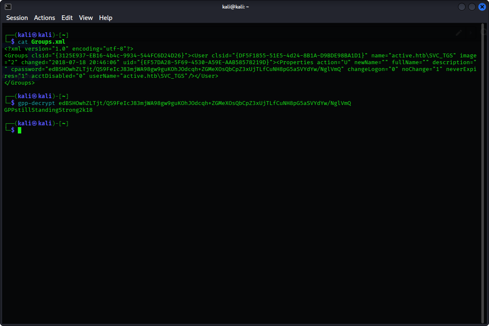

Using `smbmap` again but this time with the username and password obtained we find that we have `READ ONLY` access to NETLOGON, Replication, SYSVOL and `Users`.` `Our next` `target is the` Users share `which appeared to be a valuable target.

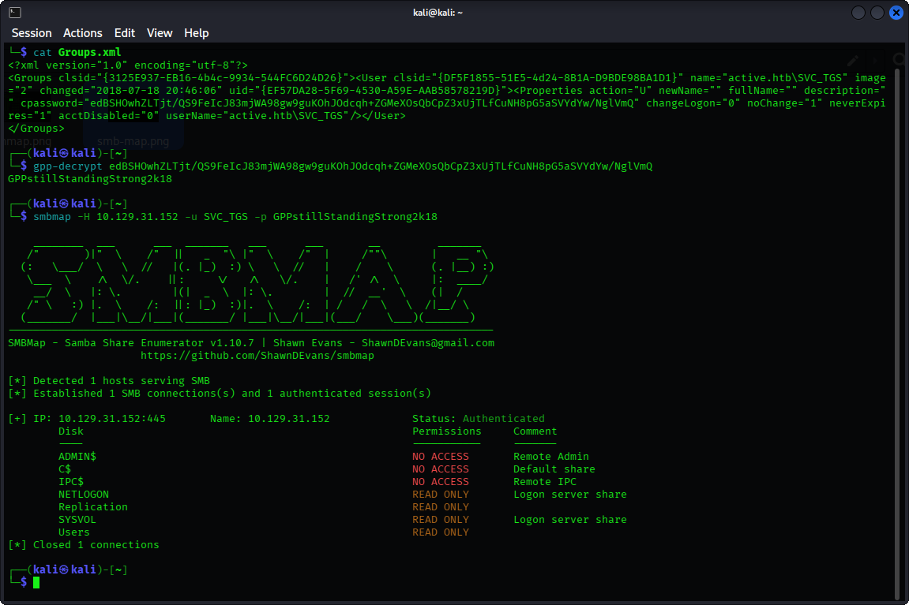

By navigating to Users → SVC_TGS → Desktop → user.txt → get `user.txt `

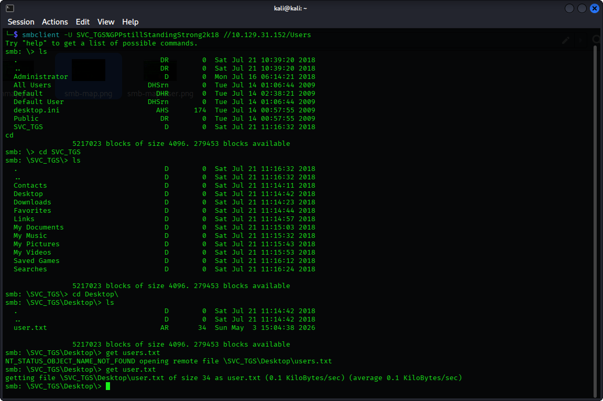

And we get the `user flag`  

---

### **4. Privilege Escalation**

#### We have noticed from the nmap results that the LDAP/S ports are open. Since LDAP was accessible, Impacket enumeration tools such as `GetADUsers.py` are viable. Using the `GetADUsers.py` script we enumerated domain users and spotted the user `Administrator`.

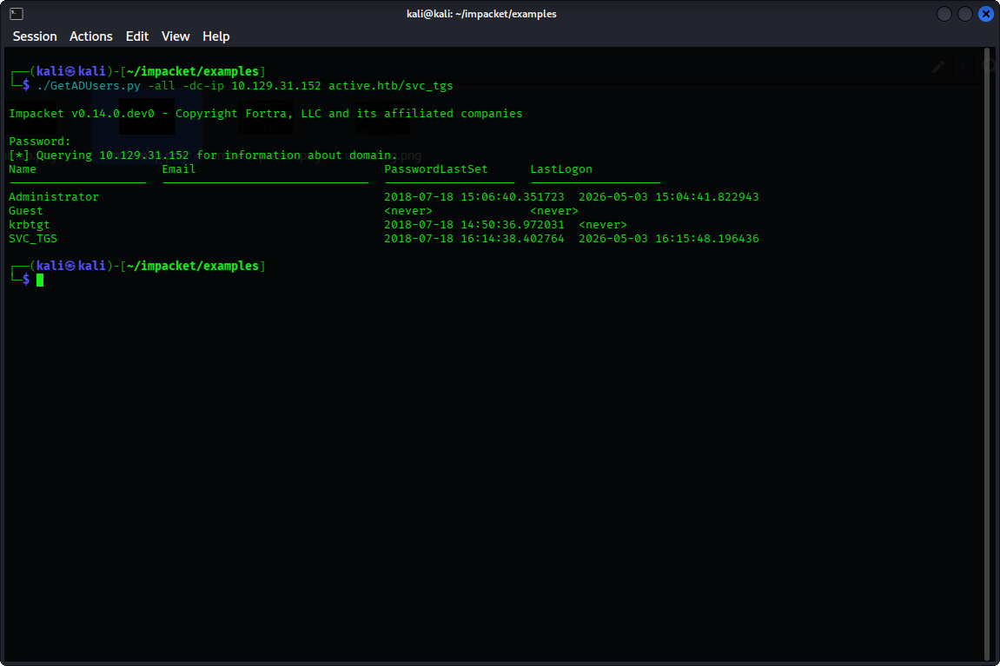

#### We then use` GetUserSPNs.py` to identify accounts with SPN and we find that the Administrator user has an SPN configured hence enabling `Kerberoasting`. We get a `TGS hash`

#### 

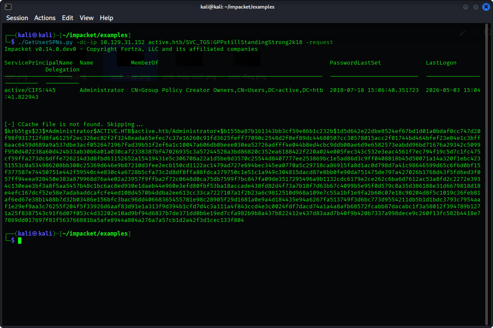

By saving the hash we obtained we can then do some offline bruteforcing using `hashcat` mode 13100 (-m 13100) we get the password: `Ticketmaster1968 `(Using `hashwiki` you can know which mode to use). 

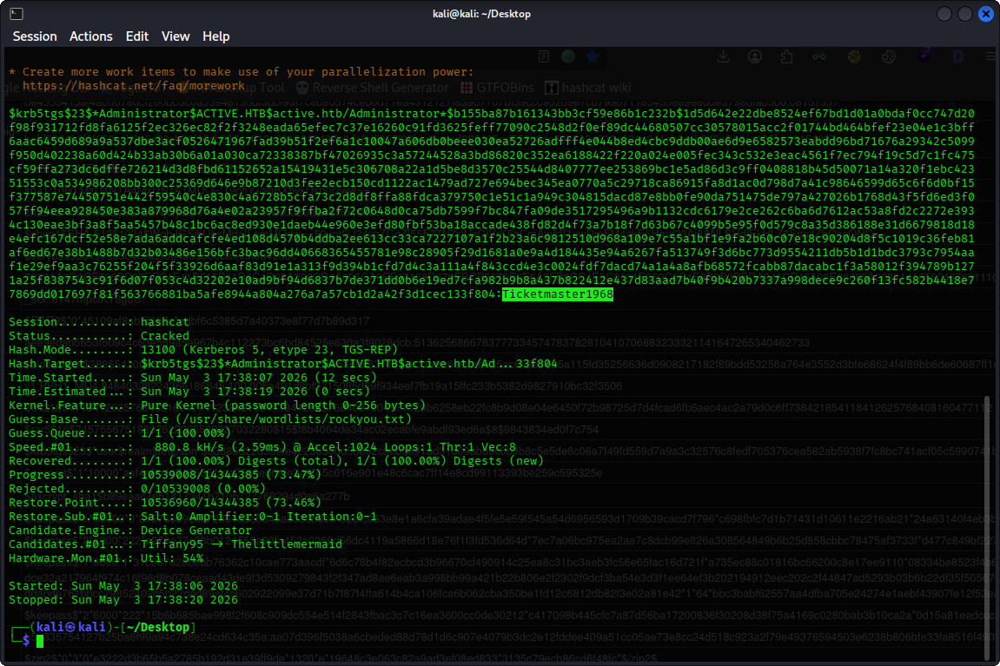

Using `smbmap` again with the Administrator’s credentials we have identified two main targets: `ADMIN$` and `C$`  

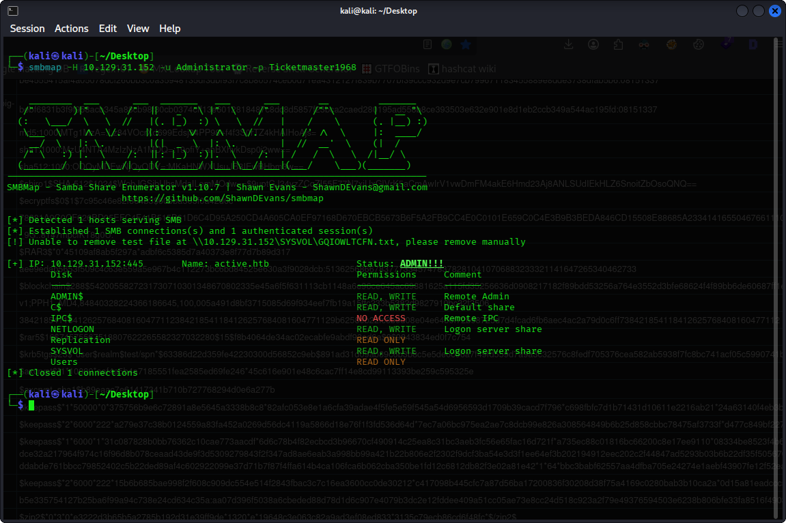

After checking both shares we found the root flag!  \
C$ → Users → Administrator → Desktop → `root.txt`

get root.txt 

Finally, we got the `root flag` 

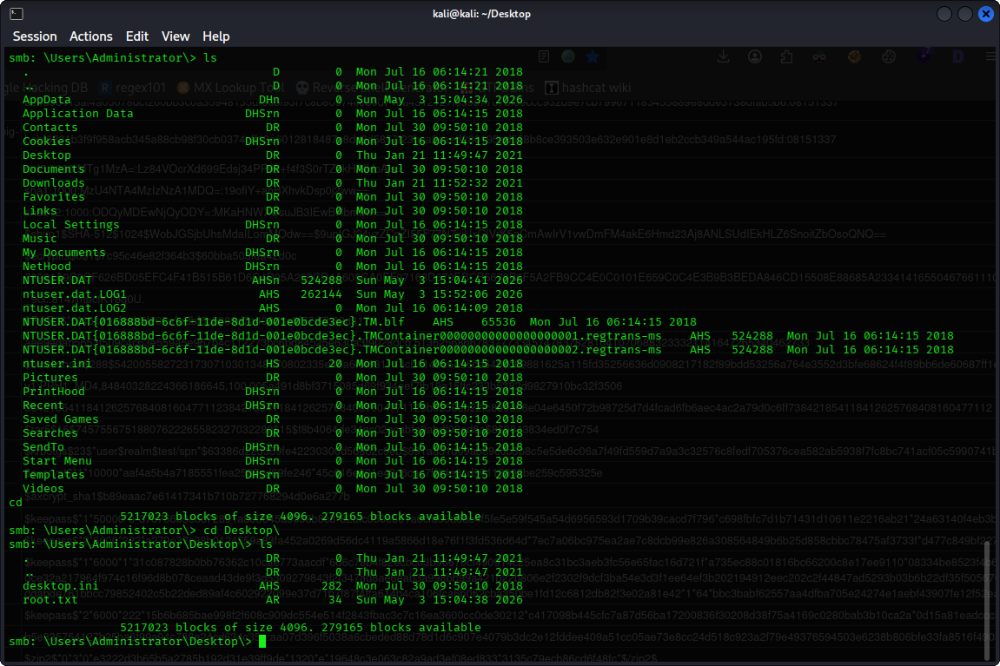

---

## 
    **5. Lessons Learned**

### 
    **Key Takeaways**

* Anonymous SMB access can expose sensitive internal files to unauthenticated users.
* Misconfigured share permissions may allow attackers to access confidential data such as Group Policy Preference files.
* `cpassword` values stored in GPP files are insecure and can be decrypted using publicly known keys.
* Weak privileged account passwords remain vulnerable to offline cracking attacks such as Kerberoasting.
* Excessive permissions across shares can accelerate privilege escalation and full domain compromise.

### 
    **Mitigation**

* Disable anonymous SMB enumeration and guest access.
* Review and restrict SMB share permissions using least privilege.
* Remove legacy Group Policy Preference passwords and rotate exposed credentials immediately.
* Enforce strong password policies for privileged and service accounts.
* Implement Microsoft Active Directory Managed Service Accounts (gMSA) where possible.
* Monitor Kerberos ticket requests for abnormal SPN activity.
* Restrict administrative share access (`C$`, `ADMIN$`) to authorized administrators only.
* Enable logging and alerting for suspicious authentication activity.

---
